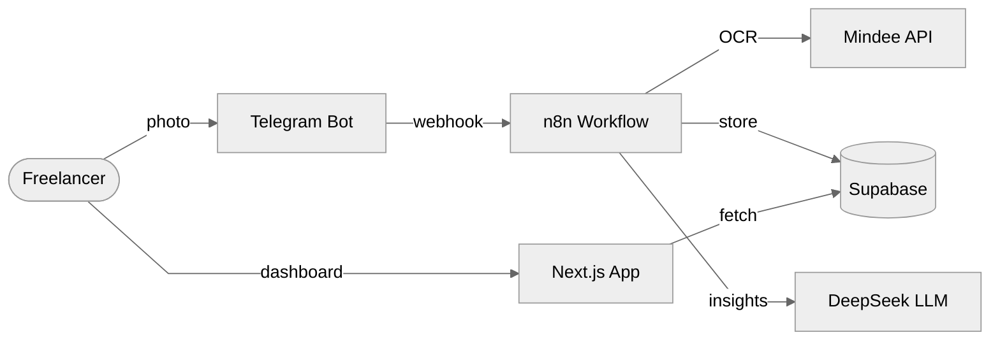
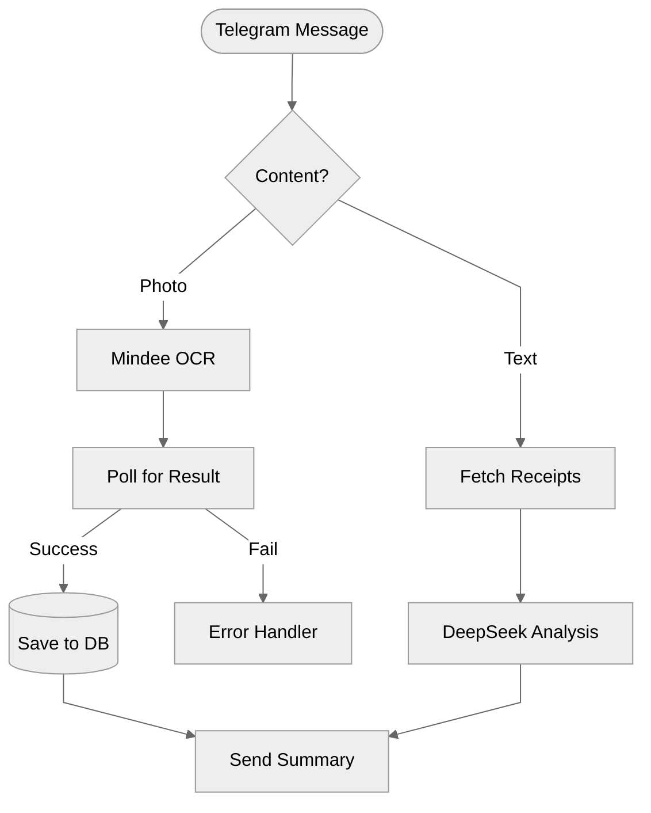
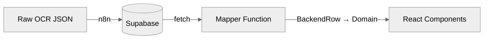

# Účtenka

AI-powered receipt tracking for freelancers and self-employed professionals. Send a photo of a receipt via Telegram and the system extracts merchant details, amounts, tax breakdowns, and categories automatically. All data lands in a searchable dashboard with spending analytics and CSV export.

Built in 7 hours at [**Hackathon ENGETO & KBC 2026** -- **1st place**](https://engeto.cz/blog/novinky/hackathon-engeto-kbc-2026-od-napadu-k-demu/).

---

## The Problem

Freelancers in the Czech Republic deal with a steady stream of paper receipts. Every purchase needs to be logged, categorized, and stored for tax purposes. The typical workflow -- collecting receipts in a shoebox, manually typing them into a spreadsheet once a month -- is error-prone and time-consuming. OCR apps exist, but they rarely handle Czech receipts well and almost never integrate with the tools freelancers already use.

## How It Works

1. **Snap and send.** The user takes a photo of a receipt and sends it to a Telegram bot.
2. **Automatic extraction.** An n8n workflow picks up the image, uploads it to Supabase storage, and submits it to the Mindee OCR API. The system polls for results, handling timeouts and retries automatically.
3. **Instant summary.** Within seconds, the bot replies with the extracted merchant name, total amount, tax breakdown, date, and receipt number -- formatted and ready to verify.
4. **Dashboard and export.** All receipts appear in a Next.js dashboard with monthly spending charts, category breakdowns, and a review queue for low-confidence extractions. Data can be exported as CSV for an accountant.

Users can also send text queries to the bot. The workflow fetches their receipt history, aggregates it, and passes it to an LLM for natural-language financial analysis.

---

## Architecture



## n8n Automation Flow



## Data Layer



The frontend never touches raw database types. A `Repository` interface abstracts the data source, with `SupabaseRepository` as the active implementation and `MockRepository` available for offline development or demo. Swapping backends requires zero UI changes.

---

## Hackathon

This project won **1st place** at Hackathon ENGETO & KBC 2026 (March 7, Brno), scoring **83 out of 105 points** against 9 other teams. The challenge: build an AI agent that solves a real-world problem in finance, work, or daily life -- in 7 hours.

The judges' feedback, as [reported by ENGETO](https://engeto.cz/blog/novinky/hackathon-engeto-kbc-2026-od-napadu-k-demu/):

> "A solution that saves freelancers tens of minutes every week: just send a receipt via a message, the system processes and stores it automatically. Simple, practical, and functional -- exactly what convinced the jury. And the presentation? A real-time demo that made the whole hall laugh and took everyone's breath away."

---

## Tech Stack

| Layer | Technologies |
| :--- | :--- |
| **Frontend** | Next.js 15, TypeScript 5, Tailwind CSS v4, shadcn/ui, Recharts |
| **Automation** | n8n, Mindee OCR, DeepSeek LLM (OpenAI-compatible API) |
| **Data** | Supabase, Zod, date-fns |
| **Deployment** | Netlify |

## Running Locally

```bash
npm install
cp .env.example .env.local
npm run dev
```

Opens at `http://localhost:3000`.

## Project Structure

```
src/
  app/                  # Next.js pages (App Router)
  components/
    dashboard/          # KPI cards, charts
    receipts/           # Table, detail, upload
    review/             # Review queue wizard
    settings/           # Profile, Telegram setup
    shared/             # Page header, badges, states
    ui/                 # shadcn/ui primitives
  lib/
    data/               # Repository pattern, mappers, mock data
    constants/          # Categories, navigation
    formatters/         # Currency, date (Czech locale)
  types/
    domain.ts           # Stable frontend types
    backend.ts          # Backend row placeholders
```
